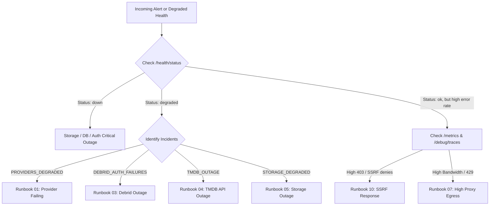

# CINEFLIX addons-core Incident Response & Operational Runbooks

This directory contains production-ready operational runbooks for diagnosing, mitigating, and resolving incidents in `addons-core`.

---

## Runbook Master Index

| # | Runbook | Severity | Trigger / Symptoms | Primary Mitigation |
|---|---|---|---|---|
| 01 | [Provider Failing / Circuit Breakers](file:///home/seemoo/Documents/CINEFLIX%20Project/addons-core/docs/runbooks/provider-failing.md) | High / Medium | `addons_core_provider_failure_ratio > 0.4` or circuit state `open` | Emergency disable / adjust timeout / inspect upstream |
| 02 | [Residential Proxy Failure / Egress Blocked](file:///home/seemoo/Documents/CINEFLIX%20Project/addons-core/docs/runbooks/residential-proxy-failure.md) | High | `SCRAPE_PROXY_URL` returning 407/502 or upstream Cloudflare blocks | Rotate proxy credentials / failover proxy mode |
| 03 | [Debrid Outage / Key Expiration / Auth Failures](file:///home/seemoo/Documents/CINEFLIX%20Project/addons-core/docs/runbooks/debrid-outage.md) | High | `addons_core_debrid_errors_total > 5` or `AUTH_FAILURE` alerts | Rotate debrid API token / test credentials / switch resolver |
| 04 | [TMDB API Outage / Rate Limits](file:///home/seemoo/Documents/CINEFLIX%20Project/addons-core/docs/runbooks/tmdb-outage.md) | Critical | `TMDB_OUTAGE` incident or TMDB 429/500 responses | Rotate TMDB key / verify negative cache / check fallback IDs |
| 05 | [Storage & Cache Backend Outage](file:///home/seemoo/Documents/CINEFLIX%20Project/addons-core/docs/runbooks/storage-cache-outage.md) | Critical | Redis down / File store disk read-only / Optimistic lock spikes | Failover to backup Redis / repair file permissions / fallback mode |
| 06 | [Stuck Background Jobs & Lease Expiry](file:///home/seemoo/Documents/CINEFLIX%20Project/addons-core/docs/runbooks/stuck-jobs.md) | Medium | Jobs in `running` state past lease duration / Dead letters | Re-acquire dead leases / purge dead letters / cancel stuck jobs |
| 07 | [High Proxy Egress & Bandwidth Spikes](file:///home/seemoo/Documents/CINEFLIX%20Project/addons-core/docs/runbooks/high-proxy-egress.md) | Medium | `addons_core_proxy_egress_bytes_total` spikes / Range flood | Tighten grant TTL / rate limit abusive IP / lower max stream size |
| 08 | [Credential Rotation Procedures](file:///home/seemoo/Documents/CINEFLIX%20Project/addons-core/docs/runbooks/credential-rotation.md) | Standard Ops | Scheduled or emergency key rotation (Master Key, Secrets, Tokens) | Zero-downtime rotation with dual-key / phased redeployment |
| 09 | [Disaster Recovery & Data Restore](file:///home/seemoo/Documents/CINEFLIX%20Project/addons-core/docs/runbooks/data-restore.md) | Critical | Data corruption / disk loss / unrecoverable storage state | Restore from `.bak` snapshot / re-import sanitized config |
| 10 | [SSRF & Security Incident Response](file:///home/seemoo/Documents/CINEFLIX%20Project/addons-core/docs/runbooks/ssrf-security-incident.md) | Critical | `addons_core_proxy_denied_ssrf_total` rising / Private IP probes | Isolate addon / revoke grants / update URL policy allowlist |
| 11 | [Emergency Addon Quarantine](file:///home/seemoo/Documents/CINEFLIX%20Project/addons-core/docs/runbooks/emergency-quarantine-addon.md) | High | Malicious addon manifest / spam streams / memory leaking | Force-disable addon / trip circuit / trigger instant sweep |
| 12 | [Zero-Downtime Deployment Rollback](file:///home/seemoo/Documents/CINEFLIX%20Project/addons-core/docs/runbooks/deployment-rollback.md) | Critical | Failed migration / post-deployment crash loops / API 500 spikes | Rollback container image / revert schema migration / restore state |
| 13 | [Graceful Shutdown & Rolling Deploy Verification](file:///home/seemoo/Documents/CINEFLIX%20Project/addons-core/docs/runbooks/graceful-shutdown-rolling-deploy.md) | Standard Ops | Deploys / SIGTERM / `SHUTTING_DOWN` 503s / `WORKER_SHUTDOWN` job errors | Verify grace periods / watch readiness drain / confirm job retry |

---

## Fast Incident Triage Matrix

## Useful Diagnostic Endpoints

- **Liveness Probe**: `GET /health/live` (200 if event loop active)
- **Readiness Probe**: `GET /health/ready` (200 if storage, cache, jobs ready)
- **Full Health & Incident Status**: `GET /health/status` (200 or 503 with active incident codes)
- **Detailed Dependencies**: `GET /health/dependencies` (Storage, Cache, TMDB, Debrid status)
- **Prometheus Metrics**: `GET /metrics` (Requires `Authorization: Bearer <ADMIN_TOKEN>`)
- **Trace Inspector**: `GET /debug/traces?hasError=true` (Requires Admin Token)
- **Provider Debug**: `GET /debug/providers/:id` (Circuit status, consecutive errors, error classification)
